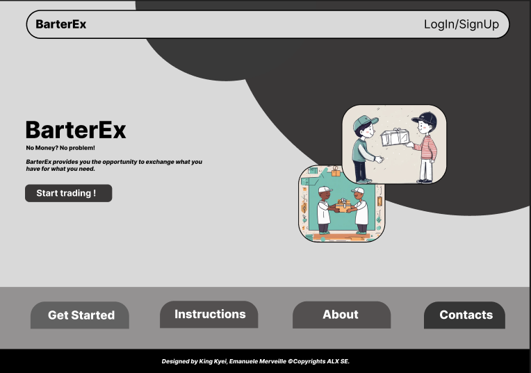
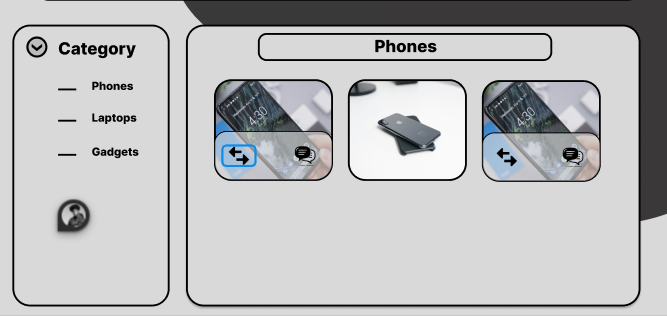

<div style="display: flex; justify-content: center;"></div>

# BarterEx: A Barter Trading System for People Living in Ghana

BarterEx is a platform designed to streamline the traditional barter trade system by offering a digital solution. It allows users to list, search for, and trade goods and services easily without involving cash. The app focuses on providing a user-friendly and intuitive interface while ensuring secure and efficient transaction.

## Team Members

- **King Kyei Boakye** (Founder & Backend Developer)  
- **Emanuele Merveille Guehi** (Front-end Developer)

### Team Responsibilities:

- **Emanuele Merveille Guehi (Front-end Developer)**
  - Frontend Development: Creating a responsive and user-friendly interface using React/Next.js, Vite, and Tailwind CSS.
  - Backend Development: Assisting with database management, authentication, and implementing backend logic using Node.js.
  - API Integration: Developing APIs using Node.js to connect the front end with MongoDB and other services.
  - Design: Participating in design elements using Figma and Adobe XD.
  - Testing & QA: Conducting unit testing with Jest and end-to-end testing with Cypress.
  - Content Management: Managing the initial data population in MongoDB, handling content updates, and verification.

---

### Team Responsibilities:

- **King Kyei Boakye (Back-end Developer)**
  - Backend Development: Assisting with database management, authentication, and implementing backend logic using Node.js.
  - API Integration: Developing APIs using Node.js to connect the front end with MongoDB and other services.
  - Testing & QA: Conducting unit testing with Jest and end-to-end testing with Cypress.
  - Content Management: Managing the initial data population in MongoDB, handling content updates, and verification.

---

## Project Inspiration

BarterEx was born out of the need to modernize the barter trade system, especially in regions like Ghana where traditional bartering is still common. The goal was to create a seamless and digital solution to make trading more accessible and organized for individuals and small businesses.  

Our biggest challenge was figuring out how to make the app both functional and visually appealing, while ensuring security and scalability. Through trial and error, especially with API integration and handling real-time updates, we learned valuable lessons that made our app better.

## Technologies Used

- **Frontend**: React, Next.js, Vite, Tailwind CSS
- **Backend**: Node.js, Express.js, MongoDB
- **Testing**: Jest, Cypress, Mocha
- **Authentication**: bcryptjs, jsonwebtoken
- **API Calls**: Axios

### Tools and Resources

- **Design**: Figma, Adobe XD
- **Deployment**: Netlify (Frontend), Heroku (Backend)
- **Version Control**: GitHub

## Installation

1. Clone the repository:

   ```bash
   git clone https://github.com/yourusername/BarterEx.git
   cd BarterEx
   ```

2. Navigate to the backend folder and install dependencies:

   ```bash
   cd backend
   npm install
   ```

3. Setup environment variables in the `.env` file:

   ```bash
   MONGO_URI=your_mongodb_connection_string
   JWT_SECRET=your_jwt_secret
   ```

4. Start the backend:

   ```bash
   npm run dev
   ```

5. Navigate to the frontend folder and install dependencies:

   ```bash
   cd frontend
   npm install
   ```

6. Start the frontend:

   ```bash
   npm run dev
   ```

## Features

- **User Registration & Authentication**: Secure registration and login with JWT authentication.
- **Item Listings**: Users can list items they want to trade, with photos, descriptions, and categories.
- **Search & Filters**: Advanced search functionality to help users find the exact items they need.
- **Messaging**: Integrated messaging system for negotiating trades between users.
- **Ratings & Reviews**: Users can leave feedback after a successful trade.
- **Notifications**: Real-time notifications for trade offers, messages, and updates.

---

## Usage

1. **Create an Item**: Navigate to the "Create Item" page, fill in the details, and submit.
2. **Search & Trade**: Use filters to search for items, initiate trades, and communicate with other users.
3. **Manage Your Profile**: View your listed items, edit or delete them, and update your profile.

---

## Screenshots




---

## Contributing

We welcome contributions! Here's how you can get started:

1. Fork the project
2. Create your feature branch (`git checkout -b feature/YourFeature`)
3. Commit your changes (`git commit -m 'Add a new feature'`)
4. Push to the branch (`git push origin feature/YourFeature`)
5. Open a Pull Request

---

## Challenges & Lessons Learned

**Technical Challenges**  
- Integrating the authentication system was initially challenging as we had to ensure the security of user data while keeping the system scalable.
- Real-time updates between the frontend and backend using WebSockets were tricky to implement but greatly improved the user experience for messaging and notifications.

**What’s Next?**  
- In the next iteration, we plan to integrate a location-based feature that helps users find trades near their location using GPS. We also aim to implement a mobile version of the app using React Native.

---

## Related Projects

- **Craigslist (Barter Section)**: A similar platform but with limited features for barter-specific trading.
- **Bunz**: A community-based barter app with a focus on social features.

---

## License

This project is licensed under the MIT License. See the [LICENSE](LICENSE) file for more details.
```


